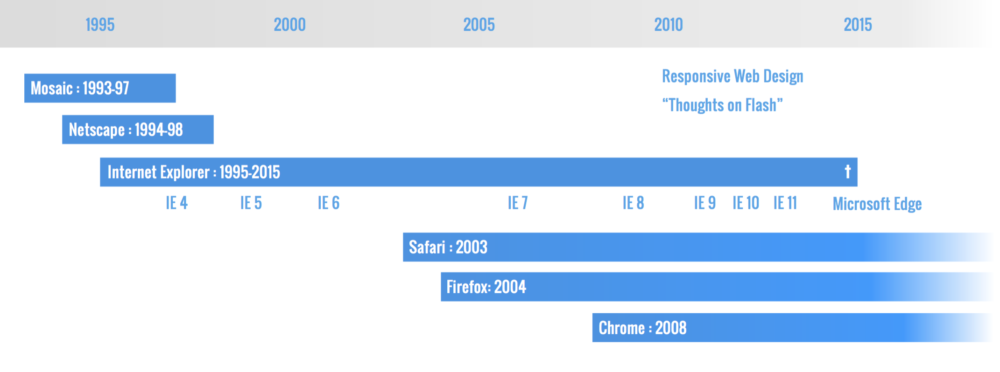

Le web, ou également nommé **WWW** (Word Wide Web), est un des services
d'Internet les plus connus:

- FTP: transfert de fichier
- IMAP, POP3, SMTP: Le courrier électronique (l'email)
- HTTP: Web (documents hypertextes)

Le web est un système permettant d'accéder à un ensemble des documents
hypertextes en utilisant principalement navigateur. Le web était développé par
Tim Berners-Lee au CERN (Suisse) en 1990.

Un document hypertexte est principalement un document texte écrit en
HTML/CSS/JavaScript contenant des unités d'information liées entre elles par
des hyperliens. Mais, le type du document peut être aussi un texte, audio,
image, vidéo ou binaire.

Les documents en web sont regrouper en ensembles des sites web identifiés par
des noms de domaines. Pour accéder à un document dans un site web, on saisi
l'URL: le nom de domaine de cet site web et le chemin du document dans la barre
d'adresse de le navigateur. Exemples des sites web populaires:

- [Google](https://google.com)
- [Wikipédia](https://fr.wikipedia.org/wiki/World_Wide_Web)
- [GitHub](https://github.com)

Pour l'échange de ces documents, le web utilise le protocole HTTP (HyperText
Transfer Protocol) qui permet la communication entre le client (navigateur) et
le serveur. On peut nommer comme navigateurs principales dans le marché:

- **Google Chrome** - développé par Google depuis 2008. Il était basé sur le
  même moteur de rendu que Safari jusqu'à 2013
- **Firefox** - développé par Mozilla depuis 2004 comme un successeur de
  **Netscape**
- **Safari** - développé par Apple depuis 2003
- **Microsoft Edge** - développé par Microsoft comme successeur d'**Internet
  Explorer** développé depuis 1995
- **Opera** - développé depuis 1994. Depuis 2013, il est basé sur le même
  moteur de rendu que Chrome

